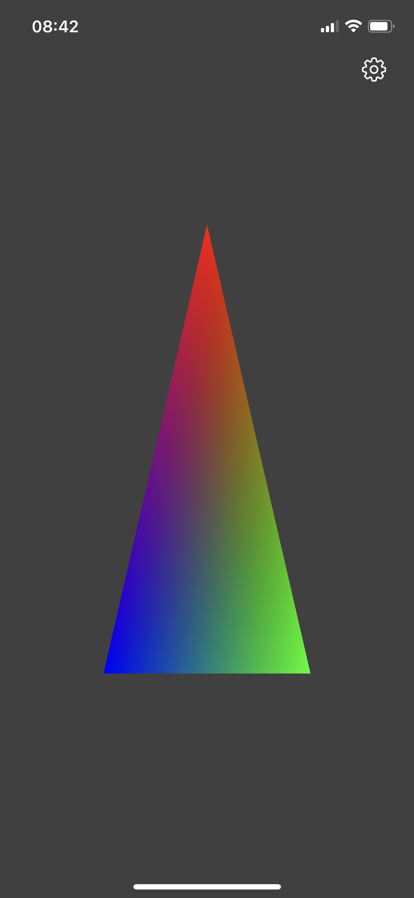
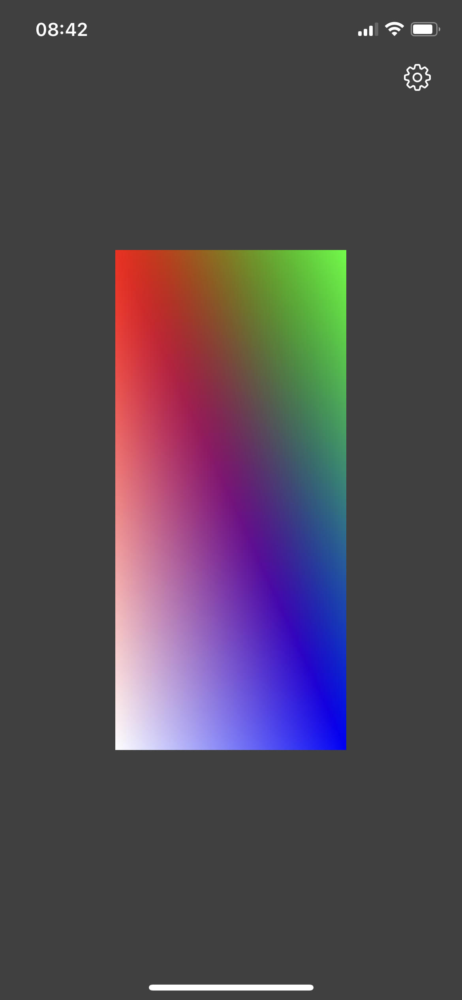
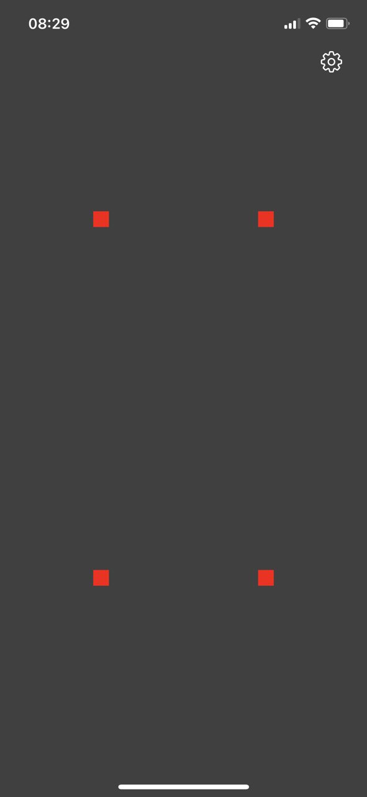
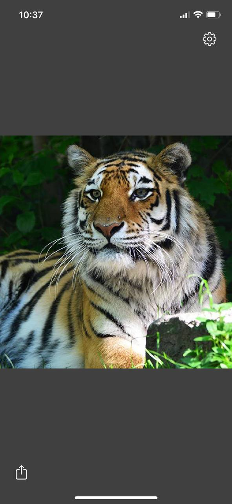
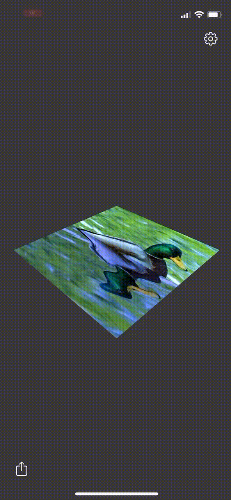
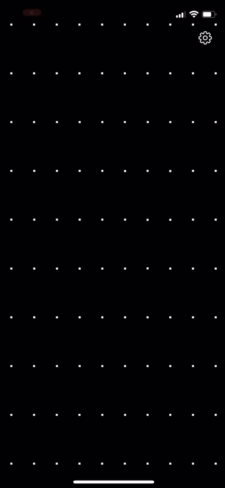

## OpenGL with iOS

This project provides various examples of how OpenGL ES 3 can be used on the iOS platform. The project is written entirely in swift

## Usage

Just download this project and run it in Xcode. No additional dependencies required

## Examples

The project consists of a list of renderers that use various OpenGl techniques in order to draw something interesting (or not). I will not describe in detail how they work, I will only briefly describe each renderer (what features OpenGL uses and what the result looks like)

##### GLRenderer

The base renderer from which all others are inherited. Can draw simple 2D shapes

| Simple Triangle                                                          | Simple Rectangle                                                          |
|:------------------------------------------------------------------------:|:-------------------------------------------------------------------------:|
|  |  |

##### Points renderer

The simplest renderer. Takes 2D points and draws them

| Points                                                                    |
|:-------------------------------------------------------------------------:|
|  |

##### Texture renderer

Able to draw a texture from an image (you can choose from a photo gallery). The vertexShader (TextureVertex.glsl) uses several attributes (position, texture coordinates). The shader also contains the logic of texture rotation using the transformation matrix and adapting the aspect ratio. To transfer the texture to OpenGL, the GLTexture class is used, which can convert a UIImage to a bitmap

| Texture                                                                      |
|:----------------------------------------------------------------------------:|
|  |

##### Texture in 3D

This renderer draws an animated texture in 3D space. For this ObjWithTextureVertex shader uses 3 transformation matrices. model, view and projection. There are 2 types of animations: TextureMixFragment shader changes 2 textures with fade animation. TextureWithWaterEffectFragment adds a water effect. You can also rotate the texture by tapping on the screen. You can select images from gallery for this renderer. But perhaps they will be flattened or rotated, since I did not implement adaptation depending on the image size and rotations (as it is done in the texture renderer)

| Textures transition                                                          | Texture with water effect                                                        |
|:----------------------------------------------------------------------------:|:--------------------------------------------------------------------------------:|
|  |  |

##### Box renderer

Draws a 3D box using GL_DEPTH_TEST and GL_STENCIL_TEST for the mirror floor

| Box                                                                   |
|:---------------------------------------------------------------------:|
|  |

##### Post processing renderer

Rendering happens in 2 stages. At the first 3D object is rendered into a separate textureBuffer, at the second stage the resulting texture is rendered into a drawable framebuffer. This solution allows you to work with complex objects as textures and implement various effects.

| Inverce                                                                   | Grayscale                                                                   | Blur                                                                   | Sobel                                                                   |
|:-------------------------------------------------------------------------:|:---------------------------------------------------------------------------:|:----------------------------------------------------------------------:|:-----------------------------------------------------------------------:|
|  |  |  |  |

##### Two step post processing

Works just like a post processing renderer, except that here the resulting texture is processed 2 times before the final rendering

| Two pass gaussian blur                                                        |
|:-----------------------------------------------------------------------------:|
|  |

##### Box with mirror renderer

Here again, the technique of two-stage rendering is used. The texture obtained after the first step is rendered into a 3D object this time. This way you can implement a mirror

| Box with mirror                                                                 |
|:-------------------------------------------------------------------------------:|
|  |

##### Gravity points renderer

This renderer is based on GL_TRANSFORM_FEEDBACK_BUFFER. The GravityPointsVertex shader dynamically calculates a new position based on the point's finger position, and the renderer updates the buffer accordingly.

| Gravity points                                                                  |
|:-------------------------------------------------------------------------------:|
|  |
